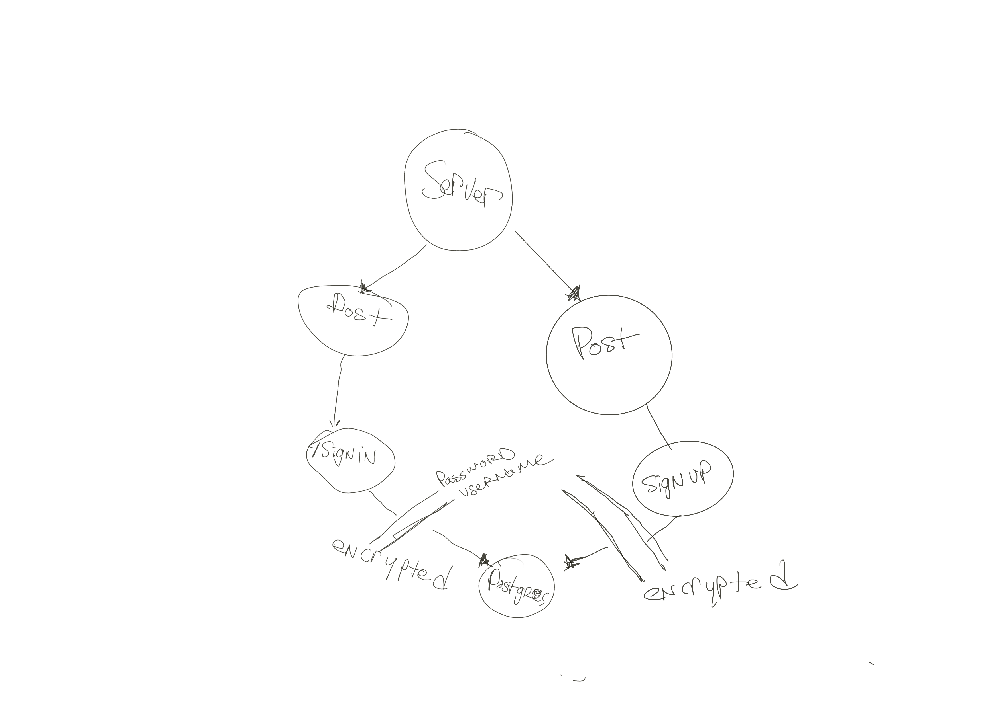

# bearer-auth
Authentication Server Phase 2: Token (Bearer) Authentication

## Author - Tek Jones
---

## Deployment - https://tekjones-basic-auth.herokuapp.com/
---

## UML - 

## Routes
* signup
- req, res, next
- JSON response: {"username":"value", "password":"value"}

* signin
- req, res, next
- JSON response: none
- Authentication: basic (username and password)

